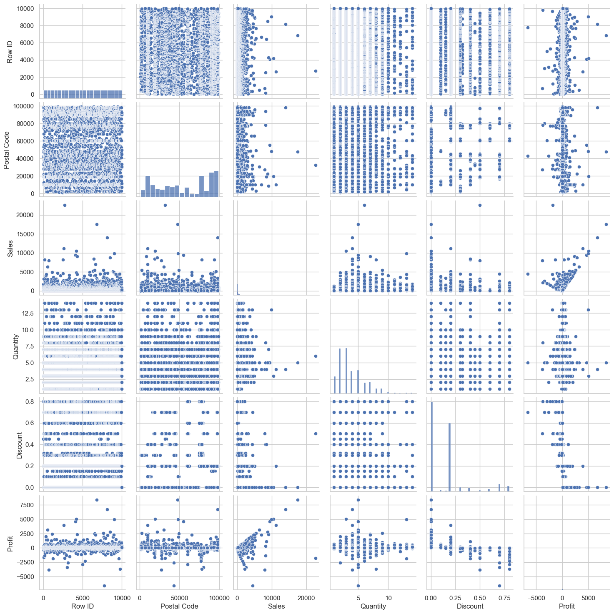
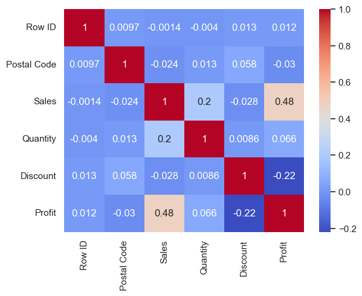
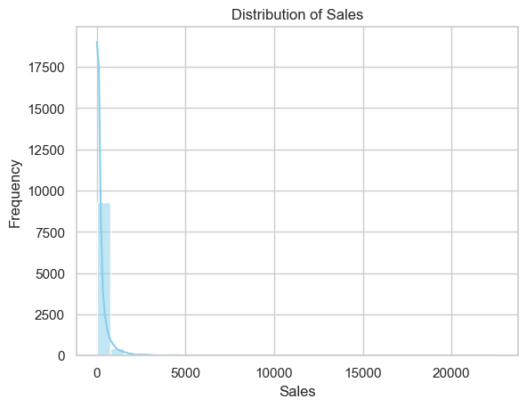
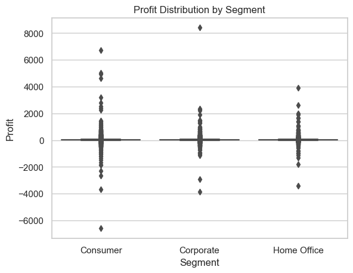
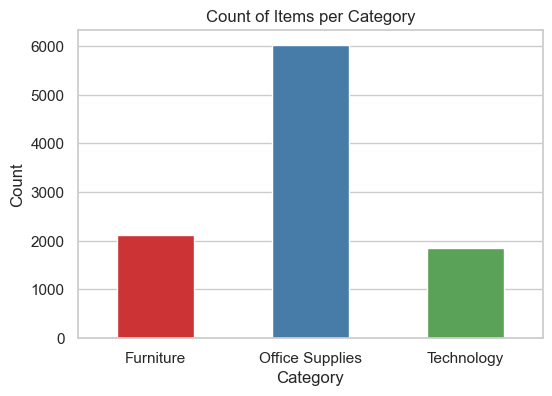
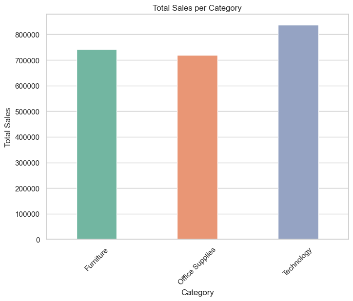

```python
import pandas as pd
import numpy as np
import matplotlib.pyplot as plt
import seaborn as sns    
```


```python
#reading file path
super_data = pd.read_csv("C:\\Users\\91967\\Downloads\\Sample__Superstore2.csv", encoding='ISO-8859-1')

```


```python
#top 5 data
super_data.head()
```


<div>
<style scoped>
    .dataframe tbody tr th:only-of-type {
        vertical-align: middle;
    }

    .dataframe tbody tr th {
        vertical-align: top;
    }

    .dataframe thead th {
        text-align: right;
    }
</style>
<table border="1" class="dataframe">
  <thead>
    <tr style="text-align: right;">
      <th></th>
      <th>Row ID</th>
      <th>Order ID</th>
      <th>Order Date</th>
      <th>Ship Date</th>
      <th>Ship Mode</th>
      <th>Customer ID</th>
      <th>Customer Name</th>
      <th>Segment</th>
      <th>Country</th>
      <th>City</th>
      <th>...</th>
      <th>Postal Code</th>
      <th>Region</th>
      <th>Product ID</th>
      <th>Category</th>
      <th>Sub-Category</th>
      <th>Product Name</th>
      <th>Sales</th>
      <th>Quantity</th>
      <th>Discount</th>
      <th>Profit</th>
    </tr>
  </thead>
  <tbody>
    <tr>
      <th>0</th>
      <td>1</td>
      <td>CA-2016-152156</td>
      <td>11-08-2016</td>
      <td>11-11-2016</td>
      <td>Second Class</td>
      <td>CG-12520</td>
      <td>Claire Gute</td>
      <td>Consumer</td>
      <td>United States</td>
      <td>Henderson</td>
      <td>...</td>
      <td>42420</td>
      <td>South</td>
      <td>FUR-BO-10001798</td>
      <td>Furniture</td>
      <td>Bookcases</td>
      <td>Bush Somerset Collection Bookcase</td>
      <td>261.9600</td>
      <td>2</td>
      <td>0.00</td>
      <td>41.9136</td>
    </tr>
    <tr>
      <th>1</th>
      <td>2</td>
      <td>CA-2016-152156</td>
      <td>11-08-2016</td>
      <td>11-11-2016</td>
      <td>Second Class</td>
      <td>CG-12520</td>
      <td>Claire Gute</td>
      <td>Consumer</td>
      <td>United States</td>
      <td>Henderson</td>
      <td>...</td>
      <td>42420</td>
      <td>South</td>
      <td>FUR-CH-10000454</td>
      <td>Furniture</td>
      <td>Chairs</td>
      <td>Hon Deluxe Fabric Upholstered Stacking Chairs,...</td>
      <td>731.9400</td>
      <td>3</td>
      <td>0.00</td>
      <td>219.5820</td>
    </tr>
    <tr>
      <th>2</th>
      <td>3</td>
      <td>CA-2016-138688</td>
      <td>06-12-2016</td>
      <td>6-16-2016</td>
      <td>Second Class</td>
      <td>DV-13045</td>
      <td>Darrin Van Huff</td>
      <td>Corporate</td>
      <td>United States</td>
      <td>Los Angeles</td>
      <td>...</td>
      <td>90036</td>
      <td>West</td>
      <td>OFF-LA-10000240</td>
      <td>Office Supplies</td>
      <td>Labels</td>
      <td>Self-Adhesive Address Labels for Typewriters b...</td>
      <td>14.6200</td>
      <td>2</td>
      <td>0.00</td>
      <td>6.8714</td>
    </tr>
    <tr>
      <th>3</th>
      <td>4</td>
      <td>US-2015-108966</td>
      <td>10-11-2015</td>
      <td>10-18-2015</td>
      <td>Standard Class</td>
      <td>SO-20335</td>
      <td>Sean O'Donnell</td>
      <td>Consumer</td>
      <td>United States</td>
      <td>Fort Lauderdale</td>
      <td>...</td>
      <td>33311</td>
      <td>South</td>
      <td>FUR-TA-10000577</td>
      <td>Furniture</td>
      <td>Tables</td>
      <td>Bretford CR4500 Series Slim Rectangular Table</td>
      <td>957.5775</td>
      <td>5</td>
      <td>0.45</td>
      <td>-383.0310</td>
    </tr>
    <tr>
      <th>4</th>
      <td>5</td>
      <td>US-2015-108966</td>
      <td>10-11-2015</td>
      <td>10-18-2015</td>
      <td>Standard Class</td>
      <td>SO-20335</td>
      <td>Sean O'Donnell</td>
      <td>Consumer</td>
      <td>United States</td>
      <td>Fort Lauderdale</td>
      <td>...</td>
      <td>33311</td>
      <td>South</td>
      <td>OFF-ST-10000760</td>
      <td>Office Supplies</td>
      <td>Storage</td>
      <td>Eldon Fold 'N Roll Cart System</td>
      <td>22.3680</td>
      <td>2</td>
      <td>0.20</td>
      <td>2.5164</td>
    </tr>
  </tbody>
</table>
<p>5 rows × 21 columns</p>
</div>


```python
#total data set
super_data
```


<div>
<style scoped>
    .dataframe tbody tr th:only-of-type {
        vertical-align: middle;
    }

    .dataframe tbody tr th {
        vertical-align: top;
    }

    .dataframe thead th {
        text-align: right;
    }
</style>
<table border="1" class="dataframe">
  <thead>
    <tr style="text-align: right;">
      <th></th>
      <th>Row ID</th>
      <th>Order ID</th>
      <th>Order Date</th>
      <th>Ship Date</th>
      <th>Ship Mode</th>
      <th>Customer ID</th>
      <th>Customer Name</th>
      <th>Segment</th>
      <th>Country</th>
      <th>City</th>
      <th>...</th>
      <th>Postal Code</th>
      <th>Region</th>
      <th>Product ID</th>
      <th>Category</th>
      <th>Sub-Category</th>
      <th>Product Name</th>
      <th>Sales</th>
      <th>Quantity</th>
      <th>Discount</th>
      <th>Profit</th>
    </tr>
  </thead>
  <tbody>
    <tr>
      <th>0</th>
      <td>1</td>
      <td>CA-2016-152156</td>
      <td>11-08-2016</td>
      <td>11-11-2016</td>
      <td>Second Class</td>
      <td>CG-12520</td>
      <td>Claire Gute</td>
      <td>Consumer</td>
      <td>United States</td>
      <td>Henderson</td>
      <td>...</td>
      <td>42420</td>
      <td>South</td>
      <td>FUR-BO-10001798</td>
      <td>Furniture</td>
      <td>Bookcases</td>
      <td>Bush Somerset Collection Bookcase</td>
      <td>261.9600</td>
      <td>2</td>
      <td>0.00</td>
      <td>41.9136</td>
    </tr>
    <tr>
      <th>1</th>
      <td>2</td>
      <td>CA-2016-152156</td>
      <td>11-08-2016</td>
      <td>11-11-2016</td>
      <td>Second Class</td>
      <td>CG-12520</td>
      <td>Claire Gute</td>
      <td>Consumer</td>
      <td>United States</td>
      <td>Henderson</td>
      <td>...</td>
      <td>42420</td>
      <td>South</td>
      <td>FUR-CH-10000454</td>
      <td>Furniture</td>
      <td>Chairs</td>
      <td>Hon Deluxe Fabric Upholstered Stacking Chairs,...</td>
      <td>731.9400</td>
      <td>3</td>
      <td>0.00</td>
      <td>219.5820</td>
    </tr>
    <tr>
      <th>2</th>
      <td>3</td>
      <td>CA-2016-138688</td>
      <td>06-12-2016</td>
      <td>6-16-2016</td>
      <td>Second Class</td>
      <td>DV-13045</td>
      <td>Darrin Van Huff</td>
      <td>Corporate</td>
      <td>United States</td>
      <td>Los Angeles</td>
      <td>...</td>
      <td>90036</td>
      <td>West</td>
      <td>OFF-LA-10000240</td>
      <td>Office Supplies</td>
      <td>Labels</td>
      <td>Self-Adhesive Address Labels for Typewriters b...</td>
      <td>14.6200</td>
      <td>2</td>
      <td>0.00</td>
      <td>6.8714</td>
    </tr>
    <tr>
      <th>3</th>
      <td>4</td>
      <td>US-2015-108966</td>
      <td>10-11-2015</td>
      <td>10-18-2015</td>
      <td>Standard Class</td>
      <td>SO-20335</td>
      <td>Sean O'Donnell</td>
      <td>Consumer</td>
      <td>United States</td>
      <td>Fort Lauderdale</td>
      <td>...</td>
      <td>33311</td>
      <td>South</td>
      <td>FUR-TA-10000577</td>
      <td>Furniture</td>
      <td>Tables</td>
      <td>Bretford CR4500 Series Slim Rectangular Table</td>
      <td>957.5775</td>
      <td>5</td>
      <td>0.45</td>
      <td>-383.0310</td>
    </tr>
    <tr>
      <th>4</th>
      <td>5</td>
      <td>US-2015-108966</td>
      <td>10-11-2015</td>
      <td>10-18-2015</td>
      <td>Standard Class</td>
      <td>SO-20335</td>
      <td>Sean O'Donnell</td>
      <td>Consumer</td>
      <td>United States</td>
      <td>Fort Lauderdale</td>
      <td>...</td>
      <td>33311</td>
      <td>South</td>
      <td>OFF-ST-10000760</td>
      <td>Office Supplies</td>
      <td>Storage</td>
      <td>Eldon Fold 'N Roll Cart System</td>
      <td>22.3680</td>
      <td>2</td>
      <td>0.20</td>
      <td>2.5164</td>
    </tr>
    <tr>
      <th>...</th>
      <td>...</td>
      <td>...</td>
      <td>...</td>
      <td>...</td>
      <td>...</td>
      <td>...</td>
      <td>...</td>
      <td>...</td>
      <td>...</td>
      <td>...</td>
      <td>...</td>
      <td>...</td>
      <td>...</td>
      <td>...</td>
      <td>...</td>
      <td>...</td>
      <td>...</td>
      <td>...</td>
      <td>...</td>
      <td>...</td>
      <td>...</td>
    </tr>
    <tr>
      <th>9989</th>
      <td>9990</td>
      <td>CA-2014-110422</td>
      <td>1-21-2014</td>
      <td>1-23-2014</td>
      <td>Second Class</td>
      <td>TB-21400</td>
      <td>Tom Boeckenhauer</td>
      <td>Consumer</td>
      <td>United States</td>
      <td>Miami</td>
      <td>...</td>
      <td>33180</td>
      <td>South</td>
      <td>FUR-FU-10001889</td>
      <td>Furniture</td>
      <td>Furnishings</td>
      <td>Ultra Door Pull Handle</td>
      <td>25.2480</td>
      <td>3</td>
      <td>0.20</td>
      <td>4.1028</td>
    </tr>
    <tr>
      <th>9990</th>
      <td>9991</td>
      <td>CA-2017-121258</td>
      <td>2-26-2017</td>
      <td>03-03-2017</td>
      <td>Standard Class</td>
      <td>DB-13060</td>
      <td>Dave Brooks</td>
      <td>Consumer</td>
      <td>United States</td>
      <td>Costa Mesa</td>
      <td>...</td>
      <td>92627</td>
      <td>West</td>
      <td>FUR-FU-10000747</td>
      <td>Furniture</td>
      <td>Furnishings</td>
      <td>Tenex B1-RE Series Chair Mats for Low Pile Car...</td>
      <td>91.9600</td>
      <td>2</td>
      <td>0.00</td>
      <td>15.6332</td>
    </tr>
    <tr>
      <th>9991</th>
      <td>9992</td>
      <td>CA-2017-121258</td>
      <td>2-26-2017</td>
      <td>03-03-2017</td>
      <td>Standard Class</td>
      <td>DB-13060</td>
      <td>Dave Brooks</td>
      <td>Consumer</td>
      <td>United States</td>
      <td>Costa Mesa</td>
      <td>...</td>
      <td>92627</td>
      <td>West</td>
      <td>TEC-PH-10003645</td>
      <td>Technology</td>
      <td>Phones</td>
      <td>Aastra 57i VoIP phone</td>
      <td>258.5760</td>
      <td>2</td>
      <td>0.20</td>
      <td>19.3932</td>
    </tr>
    <tr>
      <th>9992</th>
      <td>9993</td>
      <td>CA-2017-121258</td>
      <td>2-26-2017</td>
      <td>03-03-2017</td>
      <td>Standard Class</td>
      <td>DB-13060</td>
      <td>Dave Brooks</td>
      <td>Consumer</td>
      <td>United States</td>
      <td>Costa Mesa</td>
      <td>...</td>
      <td>92627</td>
      <td>West</td>
      <td>OFF-PA-10004041</td>
      <td>Office Supplies</td>
      <td>Paper</td>
      <td>It's Hot Message Books with Stickers, 2 3/4" x 5"</td>
      <td>29.6000</td>
      <td>4</td>
      <td>0.00</td>
      <td>13.3200</td>
    </tr>
    <tr>
      <th>9993</th>
      <td>9994</td>
      <td>CA-2017-119914</td>
      <td>05-04-2017</td>
      <td>05-09-2017</td>
      <td>Second Class</td>
      <td>CC-12220</td>
      <td>Chris Cortes</td>
      <td>Consumer</td>
      <td>United States</td>
      <td>Westminster</td>
      <td>...</td>
      <td>92683</td>
      <td>West</td>
      <td>OFF-AP-10002684</td>
      <td>Office Supplies</td>
      <td>Appliances</td>
      <td>Acco 7-Outlet Masterpiece Power Center, Wihtou...</td>
      <td>243.1600</td>
      <td>2</td>
      <td>0.00</td>
      <td>72.9480</td>
    </tr>
  </tbody>
</table>
<p>9994 rows × 21 columns</p>
</div>


```python
#last 5 data set
super_data.tail()
```


<div>
<style scoped>
    .dataframe tbody tr th:only-of-type {
        vertical-align: middle;
    }

    .dataframe tbody tr th {
        vertical-align: top;
    }

    .dataframe thead th {
        text-align: right;
    }
</style>
<table border="1" class="dataframe">
  <thead>
    <tr style="text-align: right;">
      <th></th>
      <th>Row ID</th>
      <th>Order ID</th>
      <th>Order Date</th>
      <th>Ship Date</th>
      <th>Ship Mode</th>
      <th>Customer ID</th>
      <th>Customer Name</th>
      <th>Segment</th>
      <th>Country</th>
      <th>City</th>
      <th>...</th>
      <th>Postal Code</th>
      <th>Region</th>
      <th>Product ID</th>
      <th>Category</th>
      <th>Sub-Category</th>
      <th>Product Name</th>
      <th>Sales</th>
      <th>Quantity</th>
      <th>Discount</th>
      <th>Profit</th>
    </tr>
  </thead>
  <tbody>
    <tr>
      <th>9989</th>
      <td>9990</td>
      <td>CA-2014-110422</td>
      <td>1-21-2014</td>
      <td>1-23-2014</td>
      <td>Second Class</td>
      <td>TB-21400</td>
      <td>Tom Boeckenhauer</td>
      <td>Consumer</td>
      <td>United States</td>
      <td>Miami</td>
      <td>...</td>
      <td>33180</td>
      <td>South</td>
      <td>FUR-FU-10001889</td>
      <td>Furniture</td>
      <td>Furnishings</td>
      <td>Ultra Door Pull Handle</td>
      <td>25.248</td>
      <td>3</td>
      <td>0.2</td>
      <td>4.1028</td>
    </tr>
    <tr>
      <th>9990</th>
      <td>9991</td>
      <td>CA-2017-121258</td>
      <td>2-26-2017</td>
      <td>03-03-2017</td>
      <td>Standard Class</td>
      <td>DB-13060</td>
      <td>Dave Brooks</td>
      <td>Consumer</td>
      <td>United States</td>
      <td>Costa Mesa</td>
      <td>...</td>
      <td>92627</td>
      <td>West</td>
      <td>FUR-FU-10000747</td>
      <td>Furniture</td>
      <td>Furnishings</td>
      <td>Tenex B1-RE Series Chair Mats for Low Pile Car...</td>
      <td>91.960</td>
      <td>2</td>
      <td>0.0</td>
      <td>15.6332</td>
    </tr>
    <tr>
      <th>9991</th>
      <td>9992</td>
      <td>CA-2017-121258</td>
      <td>2-26-2017</td>
      <td>03-03-2017</td>
      <td>Standard Class</td>
      <td>DB-13060</td>
      <td>Dave Brooks</td>
      <td>Consumer</td>
      <td>United States</td>
      <td>Costa Mesa</td>
      <td>...</td>
      <td>92627</td>
      <td>West</td>
      <td>TEC-PH-10003645</td>
      <td>Technology</td>
      <td>Phones</td>
      <td>Aastra 57i VoIP phone</td>
      <td>258.576</td>
      <td>2</td>
      <td>0.2</td>
      <td>19.3932</td>
    </tr>
    <tr>
      <th>9992</th>
      <td>9993</td>
      <td>CA-2017-121258</td>
      <td>2-26-2017</td>
      <td>03-03-2017</td>
      <td>Standard Class</td>
      <td>DB-13060</td>
      <td>Dave Brooks</td>
      <td>Consumer</td>
      <td>United States</td>
      <td>Costa Mesa</td>
      <td>...</td>
      <td>92627</td>
      <td>West</td>
      <td>OFF-PA-10004041</td>
      <td>Office Supplies</td>
      <td>Paper</td>
      <td>It's Hot Message Books with Stickers, 2 3/4" x 5"</td>
      <td>29.600</td>
      <td>4</td>
      <td>0.0</td>
      <td>13.3200</td>
    </tr>
    <tr>
      <th>9993</th>
      <td>9994</td>
      <td>CA-2017-119914</td>
      <td>05-04-2017</td>
      <td>05-09-2017</td>
      <td>Second Class</td>
      <td>CC-12220</td>
      <td>Chris Cortes</td>
      <td>Consumer</td>
      <td>United States</td>
      <td>Westminster</td>
      <td>...</td>
      <td>92683</td>
      <td>West</td>
      <td>OFF-AP-10002684</td>
      <td>Office Supplies</td>
      <td>Appliances</td>
      <td>Acco 7-Outlet Masterpiece Power Center, Wihtou...</td>
      <td>243.160</td>
      <td>2</td>
      <td>0.0</td>
      <td>72.9480</td>
    </tr>
  </tbody>
</table>
<p>5 rows × 21 columns</p>
</div>


```python
#information of data 
super_data.info()
```

    <class 'pandas.core.frame.DataFrame'>
    RangeIndex: 9994 entries, 0 to 9993
    Data columns (total 21 columns):
     #   Column         Non-Null Count  Dtype  
    ---  ------         --------------  -----  
     0   Row ID         9994 non-null   int64  
     1   Order ID       9994 non-null   object 
     2   Order Date     9994 non-null   object 
     3   Ship Date      9994 non-null   object 
     4   Ship Mode      9994 non-null   object 
     5   Customer ID    9994 non-null   object 
     6   Customer Name  9994 non-null   object 
     7   Segment        9994 non-null   object 
     8   Country        9994 non-null   object 
     9   City           9994 non-null   object 
     10  State          9994 non-null   object 
     11  Postal Code    9994 non-null   int64  
     12  Region         9994 non-null   object 
     13  Product ID     9994 non-null   object 
     14  Category       9994 non-null   object 
     15  Sub-Category   9994 non-null   object 
     16  Product Name   9994 non-null   object 
     17  Sales          9994 non-null   float64
     18  Quantity       9994 non-null   int64  
     19  Discount       9994 non-null   float64
     20  Profit         9994 non-null   float64
    dtypes: float64(3), int64(3), object(15)
    memory usage: 1.6+ MB
    


```python
# null values 
super_data.isnull()
```


<div>
<style scoped>
    .dataframe tbody tr th:only-of-type {
        vertical-align: middle;
    }

    .dataframe tbody tr th {
        vertical-align: top;
    }

    .dataframe thead th {
        text-align: right;
    }
</style>
<table border="1" class="dataframe">
  <thead>
    <tr style="text-align: right;">
      <th></th>
      <th>Row ID</th>
      <th>Order ID</th>
      <th>Order Date</th>
      <th>Ship Date</th>
      <th>Ship Mode</th>
      <th>Customer ID</th>
      <th>Customer Name</th>
      <th>Segment</th>
      <th>Country</th>
      <th>City</th>
      <th>...</th>
      <th>Postal Code</th>
      <th>Region</th>
      <th>Product ID</th>
      <th>Category</th>
      <th>Sub-Category</th>
      <th>Product Name</th>
      <th>Sales</th>
      <th>Quantity</th>
      <th>Discount</th>
      <th>Profit</th>
    </tr>
  </thead>
  <tbody>
    <tr>
      <th>0</th>
      <td>False</td>
      <td>False</td>
      <td>False</td>
      <td>False</td>
      <td>False</td>
      <td>False</td>
      <td>False</td>
      <td>False</td>
      <td>False</td>
      <td>False</td>
      <td>...</td>
      <td>False</td>
      <td>False</td>
      <td>False</td>
      <td>False</td>
      <td>False</td>
      <td>False</td>
      <td>False</td>
      <td>False</td>
      <td>False</td>
      <td>False</td>
    </tr>
    <tr>
      <th>1</th>
      <td>False</td>
      <td>False</td>
      <td>False</td>
      <td>False</td>
      <td>False</td>
      <td>False</td>
      <td>False</td>
      <td>False</td>
      <td>False</td>
      <td>False</td>
      <td>...</td>
      <td>False</td>
      <td>False</td>
      <td>False</td>
      <td>False</td>
      <td>False</td>
      <td>False</td>
      <td>False</td>
      <td>False</td>
      <td>False</td>
      <td>False</td>
    </tr>
    <tr>
      <th>2</th>
      <td>False</td>
      <td>False</td>
      <td>False</td>
      <td>False</td>
      <td>False</td>
      <td>False</td>
      <td>False</td>
      <td>False</td>
      <td>False</td>
      <td>False</td>
      <td>...</td>
      <td>False</td>
      <td>False</td>
      <td>False</td>
      <td>False</td>
      <td>False</td>
      <td>False</td>
      <td>False</td>
      <td>False</td>
      <td>False</td>
      <td>False</td>
    </tr>
    <tr>
      <th>3</th>
      <td>False</td>
      <td>False</td>
      <td>False</td>
      <td>False</td>
      <td>False</td>
      <td>False</td>
      <td>False</td>
      <td>False</td>
      <td>False</td>
      <td>False</td>
      <td>...</td>
      <td>False</td>
      <td>False</td>
      <td>False</td>
      <td>False</td>
      <td>False</td>
      <td>False</td>
      <td>False</td>
      <td>False</td>
      <td>False</td>
      <td>False</td>
    </tr>
    <tr>
      <th>4</th>
      <td>False</td>
      <td>False</td>
      <td>False</td>
      <td>False</td>
      <td>False</td>
      <td>False</td>
      <td>False</td>
      <td>False</td>
      <td>False</td>
      <td>False</td>
      <td>...</td>
      <td>False</td>
      <td>False</td>
      <td>False</td>
      <td>False</td>
      <td>False</td>
      <td>False</td>
      <td>False</td>
      <td>False</td>
      <td>False</td>
      <td>False</td>
    </tr>
    <tr>
      <th>...</th>
      <td>...</td>
      <td>...</td>
      <td>...</td>
      <td>...</td>
      <td>...</td>
      <td>...</td>
      <td>...</td>
      <td>...</td>
      <td>...</td>
      <td>...</td>
      <td>...</td>
      <td>...</td>
      <td>...</td>
      <td>...</td>
      <td>...</td>
      <td>...</td>
      <td>...</td>
      <td>...</td>
      <td>...</td>
      <td>...</td>
      <td>...</td>
    </tr>
    <tr>
      <th>9989</th>
      <td>False</td>
      <td>False</td>
      <td>False</td>
      <td>False</td>
      <td>False</td>
      <td>False</td>
      <td>False</td>
      <td>False</td>
      <td>False</td>
      <td>False</td>
      <td>...</td>
      <td>False</td>
      <td>False</td>
      <td>False</td>
      <td>False</td>
      <td>False</td>
      <td>False</td>
      <td>False</td>
      <td>False</td>
      <td>False</td>
      <td>False</td>
    </tr>
    <tr>
      <th>9990</th>
      <td>False</td>
      <td>False</td>
      <td>False</td>
      <td>False</td>
      <td>False</td>
      <td>False</td>
      <td>False</td>
      <td>False</td>
      <td>False</td>
      <td>False</td>
      <td>...</td>
      <td>False</td>
      <td>False</td>
      <td>False</td>
      <td>False</td>
      <td>False</td>
      <td>False</td>
      <td>False</td>
      <td>False</td>
      <td>False</td>
      <td>False</td>
    </tr>
    <tr>
      <th>9991</th>
      <td>False</td>
      <td>False</td>
      <td>False</td>
      <td>False</td>
      <td>False</td>
      <td>False</td>
      <td>False</td>
      <td>False</td>
      <td>False</td>
      <td>False</td>
      <td>...</td>
      <td>False</td>
      <td>False</td>
      <td>False</td>
      <td>False</td>
      <td>False</td>
      <td>False</td>
      <td>False</td>
      <td>False</td>
      <td>False</td>
      <td>False</td>
    </tr>
    <tr>
      <th>9992</th>
      <td>False</td>
      <td>False</td>
      <td>False</td>
      <td>False</td>
      <td>False</td>
      <td>False</td>
      <td>False</td>
      <td>False</td>
      <td>False</td>
      <td>False</td>
      <td>...</td>
      <td>False</td>
      <td>False</td>
      <td>False</td>
      <td>False</td>
      <td>False</td>
      <td>False</td>
      <td>False</td>
      <td>False</td>
      <td>False</td>
      <td>False</td>
    </tr>
    <tr>
      <th>9993</th>
      <td>False</td>
      <td>False</td>
      <td>False</td>
      <td>False</td>
      <td>False</td>
      <td>False</td>
      <td>False</td>
      <td>False</td>
      <td>False</td>
      <td>False</td>
      <td>...</td>
      <td>False</td>
      <td>False</td>
      <td>False</td>
      <td>False</td>
      <td>False</td>
      <td>False</td>
      <td>False</td>
      <td>False</td>
      <td>False</td>
      <td>False</td>
    </tr>
  </tbody>
</table>
<p>9994 rows × 21 columns</p>
</div>


```python
#statical summery 
super_data.describe()
```


<div>
<style scoped>
    .dataframe tbody tr th:only-of-type {
        vertical-align: middle;
    }

    .dataframe tbody tr th {
        vertical-align: top;
    }

    .dataframe thead th {
        text-align: right;
    }
</style>
<table border="1" class="dataframe">
  <thead>
    <tr style="text-align: right;">
      <th></th>
      <th>Row ID</th>
      <th>Postal Code</th>
      <th>Sales</th>
      <th>Quantity</th>
      <th>Discount</th>
      <th>Profit</th>
    </tr>
  </thead>
  <tbody>
    <tr>
      <th>count</th>
      <td>9994.000000</td>
      <td>9994.000000</td>
      <td>9994.000000</td>
      <td>9994.000000</td>
      <td>9994.000000</td>
      <td>9994.000000</td>
    </tr>
    <tr>
      <th>mean</th>
      <td>4997.500000</td>
      <td>55190.379428</td>
      <td>229.858001</td>
      <td>3.789574</td>
      <td>0.156203</td>
      <td>28.656896</td>
    </tr>
    <tr>
      <th>std</th>
      <td>2885.163629</td>
      <td>32063.693350</td>
      <td>623.245101</td>
      <td>2.225110</td>
      <td>0.206452</td>
      <td>234.260108</td>
    </tr>
    <tr>
      <th>min</th>
      <td>1.000000</td>
      <td>1040.000000</td>
      <td>0.444000</td>
      <td>1.000000</td>
      <td>0.000000</td>
      <td>-6599.978000</td>
    </tr>
    <tr>
      <th>25%</th>
      <td>2499.250000</td>
      <td>23223.000000</td>
      <td>17.280000</td>
      <td>2.000000</td>
      <td>0.000000</td>
      <td>1.728750</td>
    </tr>
    <tr>
      <th>50%</th>
      <td>4997.500000</td>
      <td>56430.500000</td>
      <td>54.490000</td>
      <td>3.000000</td>
      <td>0.200000</td>
      <td>8.666500</td>
    </tr>
    <tr>
      <th>75%</th>
      <td>7495.750000</td>
      <td>90008.000000</td>
      <td>209.940000</td>
      <td>5.000000</td>
      <td>0.200000</td>
      <td>29.364000</td>
    </tr>
    <tr>
      <th>max</th>
      <td>9994.000000</td>
      <td>99301.000000</td>
      <td>22638.480000</td>
      <td>14.000000</td>
      <td>0.800000</td>
      <td>8399.976000</td>
    </tr>
  </tbody>
</table>
</div>


```python
# unique values
super_data.nunique()
```


    Row ID           9994
    Order ID         5009
    Order Date       1237
    Ship Date        1334
    Ship Mode           4
    Customer ID       793
    Customer Name     793
    Segment             3
    Country             1
    City              531
    State              49
    Postal Code       631
    Region              4
    Product ID       1862
    Category            3
    Sub-Category       17
    Product Name     1850
    Sales            5825
    Quantity           14
    Discount           12
    Profit           7287
    dtype: int64


```python
# sorting values by profit 'ascending order'
super_data.sort_values('Profit' , ascending=False ).head()
```


<div>
<style scoped>
    .dataframe tbody tr th:only-of-type {
        vertical-align: middle;
    }

    .dataframe tbody tr th {
        vertical-align: top;
    }

    .dataframe thead th {
        text-align: right;
    }
</style>
<table border="1" class="dataframe">
  <thead>
    <tr style="text-align: right;">
      <th></th>
      <th>Row ID</th>
      <th>Order ID</th>
      <th>Order Date</th>
      <th>Ship Date</th>
      <th>Ship Mode</th>
      <th>Customer ID</th>
      <th>Customer Name</th>
      <th>Segment</th>
      <th>Country</th>
      <th>City</th>
      <th>...</th>
      <th>Postal Code</th>
      <th>Region</th>
      <th>Product ID</th>
      <th>Category</th>
      <th>Sub-Category</th>
      <th>Product Name</th>
      <th>Sales</th>
      <th>Quantity</th>
      <th>Discount</th>
      <th>Profit</th>
    </tr>
  </thead>
  <tbody>
    <tr>
      <th>6826</th>
      <td>6827</td>
      <td>CA-2016-118689</td>
      <td>10-02-2016</td>
      <td>10-09-2016</td>
      <td>Standard Class</td>
      <td>TC-20980</td>
      <td>Tamara Chand</td>
      <td>Corporate</td>
      <td>United States</td>
      <td>Lafayette</td>
      <td>...</td>
      <td>47905</td>
      <td>Central</td>
      <td>TEC-CO-10004722</td>
      <td>Technology</td>
      <td>Copiers</td>
      <td>Canon imageCLASS 2200 Advanced Copier</td>
      <td>17499.95</td>
      <td>5</td>
      <td>0.0</td>
      <td>8399.9760</td>
    </tr>
    <tr>
      <th>8153</th>
      <td>8154</td>
      <td>CA-2017-140151</td>
      <td>3-23-2017</td>
      <td>3-25-2017</td>
      <td>First Class</td>
      <td>RB-19360</td>
      <td>Raymond Buch</td>
      <td>Consumer</td>
      <td>United States</td>
      <td>Seattle</td>
      <td>...</td>
      <td>98115</td>
      <td>West</td>
      <td>TEC-CO-10004722</td>
      <td>Technology</td>
      <td>Copiers</td>
      <td>Canon imageCLASS 2200 Advanced Copier</td>
      <td>13999.96</td>
      <td>4</td>
      <td>0.0</td>
      <td>6719.9808</td>
    </tr>
    <tr>
      <th>4190</th>
      <td>4191</td>
      <td>CA-2017-166709</td>
      <td>11-17-2017</td>
      <td>11-22-2017</td>
      <td>Standard Class</td>
      <td>HL-15040</td>
      <td>Hunter Lopez</td>
      <td>Consumer</td>
      <td>United States</td>
      <td>Newark</td>
      <td>...</td>
      <td>19711</td>
      <td>East</td>
      <td>TEC-CO-10004722</td>
      <td>Technology</td>
      <td>Copiers</td>
      <td>Canon imageCLASS 2200 Advanced Copier</td>
      <td>10499.97</td>
      <td>3</td>
      <td>0.0</td>
      <td>5039.9856</td>
    </tr>
    <tr>
      <th>9039</th>
      <td>9040</td>
      <td>CA-2016-117121</td>
      <td>12-17-2016</td>
      <td>12-21-2016</td>
      <td>Standard Class</td>
      <td>AB-10105</td>
      <td>Adrian Barton</td>
      <td>Consumer</td>
      <td>United States</td>
      <td>Detroit</td>
      <td>...</td>
      <td>48205</td>
      <td>Central</td>
      <td>OFF-BI-10000545</td>
      <td>Office Supplies</td>
      <td>Binders</td>
      <td>GBC Ibimaster 500 Manual ProClick Binding System</td>
      <td>9892.74</td>
      <td>13</td>
      <td>0.0</td>
      <td>4946.3700</td>
    </tr>
    <tr>
      <th>4098</th>
      <td>4099</td>
      <td>CA-2014-116904</td>
      <td>9-23-2014</td>
      <td>9-28-2014</td>
      <td>Standard Class</td>
      <td>SC-20095</td>
      <td>Sanjit Chand</td>
      <td>Consumer</td>
      <td>United States</td>
      <td>Minneapolis</td>
      <td>...</td>
      <td>55407</td>
      <td>Central</td>
      <td>OFF-BI-10001120</td>
      <td>Office Supplies</td>
      <td>Binders</td>
      <td>Ibico EPK-21 Electric Binding System</td>
      <td>9449.95</td>
      <td>5</td>
      <td>0.0</td>
      <td>4630.4755</td>
    </tr>
  </tbody>
</table>
<p>5 rows × 21 columns</p>
</div>


```python
# correlation between data set
super_datacor=super_data.corr()
super_datacor
```

    C:\Users\91967\AppData\Local\Temp\ipykernel_1912\1448244458.py:1: FutureWarning: The default value of numeric_only in DataFrame.corr is deprecated. In a future version, it will default to False. Select only valid columns or specify the value of numeric_only to silence this warning.
      super_datacor=super_data.corr()
    


<div>
<style scoped>
    .dataframe tbody tr th:only-of-type {
        vertical-align: middle;
    }

    .dataframe tbody tr th {
        vertical-align: top;
    }

    .dataframe thead th {
        text-align: right;
    }
</style>
<table border="1" class="dataframe">
  <thead>
    <tr style="text-align: right;">
      <th></th>
      <th>Row ID</th>
      <th>Postal Code</th>
      <th>Sales</th>
      <th>Quantity</th>
      <th>Discount</th>
      <th>Profit</th>
    </tr>
  </thead>
  <tbody>
    <tr>
      <th>Row ID</th>
      <td>1.000000</td>
      <td>0.009671</td>
      <td>-0.001359</td>
      <td>-0.004016</td>
      <td>0.013480</td>
      <td>0.012497</td>
    </tr>
    <tr>
      <th>Postal Code</th>
      <td>0.009671</td>
      <td>1.000000</td>
      <td>-0.023854</td>
      <td>0.012761</td>
      <td>0.058443</td>
      <td>-0.029961</td>
    </tr>
    <tr>
      <th>Sales</th>
      <td>-0.001359</td>
      <td>-0.023854</td>
      <td>1.000000</td>
      <td>0.200795</td>
      <td>-0.028190</td>
      <td>0.479064</td>
    </tr>
    <tr>
      <th>Quantity</th>
      <td>-0.004016</td>
      <td>0.012761</td>
      <td>0.200795</td>
      <td>1.000000</td>
      <td>0.008623</td>
      <td>0.066253</td>
    </tr>
    <tr>
      <th>Discount</th>
      <td>0.013480</td>
      <td>0.058443</td>
      <td>-0.028190</td>
      <td>0.008623</td>
      <td>1.000000</td>
      <td>-0.219487</td>
    </tr>
    <tr>
      <th>Profit</th>
      <td>0.012497</td>
      <td>-0.029961</td>
      <td>0.479064</td>
      <td>0.066253</td>
      <td>-0.219487</td>
      <td>1.000000</td>
    </tr>
  </tbody>
</table>
</div>


```python
# extracting data type= float 
float_data=super_data.select_dtypes(include='float')
float_data
```


<div>
<style scoped>
    .dataframe tbody tr th:only-of-type {
        vertical-align: middle;
    }

    .dataframe tbody tr th {
        vertical-align: top;
    }

    .dataframe thead th {
        text-align: right;
    }
</style>
<table border="1" class="dataframe">
  <thead>
    <tr style="text-align: right;">
      <th></th>
      <th>Sales</th>
      <th>Discount</th>
      <th>Profit</th>
    </tr>
  </thead>
  <tbody>
    <tr>
      <th>0</th>
      <td>261.9600</td>
      <td>0.00</td>
      <td>41.9136</td>
    </tr>
    <tr>
      <th>1</th>
      <td>731.9400</td>
      <td>0.00</td>
      <td>219.5820</td>
    </tr>
    <tr>
      <th>2</th>
      <td>14.6200</td>
      <td>0.00</td>
      <td>6.8714</td>
    </tr>
    <tr>
      <th>3</th>
      <td>957.5775</td>
      <td>0.45</td>
      <td>-383.0310</td>
    </tr>
    <tr>
      <th>4</th>
      <td>22.3680</td>
      <td>0.20</td>
      <td>2.5164</td>
    </tr>
    <tr>
      <th>...</th>
      <td>...</td>
      <td>...</td>
      <td>...</td>
    </tr>
    <tr>
      <th>9989</th>
      <td>25.2480</td>
      <td>0.20</td>
      <td>4.1028</td>
    </tr>
    <tr>
      <th>9990</th>
      <td>91.9600</td>
      <td>0.00</td>
      <td>15.6332</td>
    </tr>
    <tr>
      <th>9991</th>
      <td>258.5760</td>
      <td>0.20</td>
      <td>19.3932</td>
    </tr>
    <tr>
      <th>9992</th>
      <td>29.6000</td>
      <td>0.00</td>
      <td>13.3200</td>
    </tr>
    <tr>
      <th>9993</th>
      <td>243.1600</td>
      <td>0.00</td>
      <td>72.9480</td>
    </tr>
  </tbody>
</table>
<p>9994 rows × 3 columns</p>
</div>


```python
# extracting data type= object
object_data= super_data.select_dtypes(include='object')
object_data
```


<div>
<style scoped>
    .dataframe tbody tr th:only-of-type {
        vertical-align: middle;
    }

    .dataframe tbody tr th {
        vertical-align: top;
    }

    .dataframe thead th {
        text-align: right;
    }
</style>
<table border="1" class="dataframe">
  <thead>
    <tr style="text-align: right;">
      <th></th>
      <th>Order ID</th>
      <th>Order Date</th>
      <th>Ship Date</th>
      <th>Ship Mode</th>
      <th>Customer ID</th>
      <th>Customer Name</th>
      <th>Segment</th>
      <th>Country</th>
      <th>City</th>
      <th>State</th>
      <th>Region</th>
      <th>Product ID</th>
      <th>Category</th>
      <th>Sub-Category</th>
      <th>Product Name</th>
    </tr>
  </thead>
  <tbody>
    <tr>
      <th>0</th>
      <td>CA-2016-152156</td>
      <td>11-08-2016</td>
      <td>11-11-2016</td>
      <td>Second Class</td>
      <td>CG-12520</td>
      <td>Claire Gute</td>
      <td>Consumer</td>
      <td>United States</td>
      <td>Henderson</td>
      <td>Kentucky</td>
      <td>South</td>
      <td>FUR-BO-10001798</td>
      <td>Furniture</td>
      <td>Bookcases</td>
      <td>Bush Somerset Collection Bookcase</td>
    </tr>
    <tr>
      <th>1</th>
      <td>CA-2016-152156</td>
      <td>11-08-2016</td>
      <td>11-11-2016</td>
      <td>Second Class</td>
      <td>CG-12520</td>
      <td>Claire Gute</td>
      <td>Consumer</td>
      <td>United States</td>
      <td>Henderson</td>
      <td>Kentucky</td>
      <td>South</td>
      <td>FUR-CH-10000454</td>
      <td>Furniture</td>
      <td>Chairs</td>
      <td>Hon Deluxe Fabric Upholstered Stacking Chairs,...</td>
    </tr>
    <tr>
      <th>2</th>
      <td>CA-2016-138688</td>
      <td>06-12-2016</td>
      <td>6-16-2016</td>
      <td>Second Class</td>
      <td>DV-13045</td>
      <td>Darrin Van Huff</td>
      <td>Corporate</td>
      <td>United States</td>
      <td>Los Angeles</td>
      <td>California</td>
      <td>West</td>
      <td>OFF-LA-10000240</td>
      <td>Office Supplies</td>
      <td>Labels</td>
      <td>Self-Adhesive Address Labels for Typewriters b...</td>
    </tr>
    <tr>
      <th>3</th>
      <td>US-2015-108966</td>
      <td>10-11-2015</td>
      <td>10-18-2015</td>
      <td>Standard Class</td>
      <td>SO-20335</td>
      <td>Sean O'Donnell</td>
      <td>Consumer</td>
      <td>United States</td>
      <td>Fort Lauderdale</td>
      <td>Florida</td>
      <td>South</td>
      <td>FUR-TA-10000577</td>
      <td>Furniture</td>
      <td>Tables</td>
      <td>Bretford CR4500 Series Slim Rectangular Table</td>
    </tr>
    <tr>
      <th>4</th>
      <td>US-2015-108966</td>
      <td>10-11-2015</td>
      <td>10-18-2015</td>
      <td>Standard Class</td>
      <td>SO-20335</td>
      <td>Sean O'Donnell</td>
      <td>Consumer</td>
      <td>United States</td>
      <td>Fort Lauderdale</td>
      <td>Florida</td>
      <td>South</td>
      <td>OFF-ST-10000760</td>
      <td>Office Supplies</td>
      <td>Storage</td>
      <td>Eldon Fold 'N Roll Cart System</td>
    </tr>
    <tr>
      <th>...</th>
      <td>...</td>
      <td>...</td>
      <td>...</td>
      <td>...</td>
      <td>...</td>
      <td>...</td>
      <td>...</td>
      <td>...</td>
      <td>...</td>
      <td>...</td>
      <td>...</td>
      <td>...</td>
      <td>...</td>
      <td>...</td>
      <td>...</td>
    </tr>
    <tr>
      <th>9989</th>
      <td>CA-2014-110422</td>
      <td>1-21-2014</td>
      <td>1-23-2014</td>
      <td>Second Class</td>
      <td>TB-21400</td>
      <td>Tom Boeckenhauer</td>
      <td>Consumer</td>
      <td>United States</td>
      <td>Miami</td>
      <td>Florida</td>
      <td>South</td>
      <td>FUR-FU-10001889</td>
      <td>Furniture</td>
      <td>Furnishings</td>
      <td>Ultra Door Pull Handle</td>
    </tr>
    <tr>
      <th>9990</th>
      <td>CA-2017-121258</td>
      <td>2-26-2017</td>
      <td>03-03-2017</td>
      <td>Standard Class</td>
      <td>DB-13060</td>
      <td>Dave Brooks</td>
      <td>Consumer</td>
      <td>United States</td>
      <td>Costa Mesa</td>
      <td>California</td>
      <td>West</td>
      <td>FUR-FU-10000747</td>
      <td>Furniture</td>
      <td>Furnishings</td>
      <td>Tenex B1-RE Series Chair Mats for Low Pile Car...</td>
    </tr>
    <tr>
      <th>9991</th>
      <td>CA-2017-121258</td>
      <td>2-26-2017</td>
      <td>03-03-2017</td>
      <td>Standard Class</td>
      <td>DB-13060</td>
      <td>Dave Brooks</td>
      <td>Consumer</td>
      <td>United States</td>
      <td>Costa Mesa</td>
      <td>California</td>
      <td>West</td>
      <td>TEC-PH-10003645</td>
      <td>Technology</td>
      <td>Phones</td>
      <td>Aastra 57i VoIP phone</td>
    </tr>
    <tr>
      <th>9992</th>
      <td>CA-2017-121258</td>
      <td>2-26-2017</td>
      <td>03-03-2017</td>
      <td>Standard Class</td>
      <td>DB-13060</td>
      <td>Dave Brooks</td>
      <td>Consumer</td>
      <td>United States</td>
      <td>Costa Mesa</td>
      <td>California</td>
      <td>West</td>
      <td>OFF-PA-10004041</td>
      <td>Office Supplies</td>
      <td>Paper</td>
      <td>It's Hot Message Books with Stickers, 2 3/4" x 5"</td>
    </tr>
    <tr>
      <th>9993</th>
      <td>CA-2017-119914</td>
      <td>05-04-2017</td>
      <td>05-09-2017</td>
      <td>Second Class</td>
      <td>CC-12220</td>
      <td>Chris Cortes</td>
      <td>Consumer</td>
      <td>United States</td>
      <td>Westminster</td>
      <td>California</td>
      <td>West</td>
      <td>OFF-AP-10002684</td>
      <td>Office Supplies</td>
      <td>Appliances</td>
      <td>Acco 7-Outlet Masterpiece Power Center, Wihtou...</td>
    </tr>
  </tbody>
</table>
<p>9994 rows × 15 columns</p>
</div>


```python
# finding duplicates
duplicates= super_data.duplicated()
duplicates
```


    0       False
    1       False
    2       False
    3       False
    4       False
            ...  
    9989    False
    9990    False
    9991    False
    9992    False
    9993    False
    Length: 9994, dtype: bool


```python
# Pair plot for numeric columns
sns.set(style='whitegrid')
sns.pairplot(super_data)
plt.show()

```


    

    


```python
Pairplot:

Question: Are there any noticeable linear relationships between pairs of numeric variables in the dataset?

Insights:
The 'Sales' and 'Profit' variables appear to have a positive linear correlation 
indicating that higher sales are associated with higher profits.
There is no significant linear correlation between 'Discount' and 'Profit' 
suggesting that offering discounts does not necessarily lead to higher profits.

Forecasting Suggestion: Based on the positive correlation between 'Sales' and 'Profit'
you might explore forecasting future sales to estimate potential profit changes.
```


```python
# Correlation heatmap
sns.set(style='whitegrid')
sns.heatmap(super_datacor , annot=True, cmap="coolwarm")
plt.show(
```


    

    


```python
Question: Which pairs of numeric variables are highly correlated?

Insights:
There is a strong positive correlation between 'Sales' and 'Profit'
indicating that higher sales are associated with higher profits.
'Discount' and 'Profit' show a negative correlation, suggesting that higher discounts may lead to lower profits.

Forecasting Suggestion: Given the strong correlation between 'Sales' and 'Profit' 
you could use sales data to forecast future profits and analyze the impact of different factors.
```


```python
# Distribution of a numeric column
sns.histplot(super_data['Sales'], bins=30, kde=True, color='skyblue')
plt.xlabel('Sales')
plt.ylabel('Frequency')
plt.title('Distribution of Sales')
plt.show()
```


    

    


```python
Question: What is the distribution of sales values in the dataset?

Insights:
The distribution of 'Sales' values is right-skewed, indicating that most sales are relatively low,
with a few instances of exceptionally high sales.
The Kernel Density Estimate plot (KDE) provides a smooth approximation of the probability density function of sales values.

Forecasting Suggestion: Using the historical distribution of sales,
you could develop a sales forecasting model to predict future sales trends.
```


```python

# Box plot for a categorical column vs. numeric column
sns.boxplot(x='Segment', y='Profit', data=super_data, palette="colorblind")
plt.xlabel('Segment')
plt.ylabel('Profit')
plt.title('Profit Distribution by Segment')
plt.show()

```


    

    


```python
Question: How does the distribution of profits vary across different customer segments?

Insights:
The 'Home Office' segment has a wider range of profit values compared to the 'Consumer' and 'Corporate' segments,
suggesting more variability in profits.
The median profit for the 'Home Office' segment is higher than the other segments, 
indicating that this segment tends to generate higher profits.

Forecasting Suggestion: By analyzing profit trends across segments, you might identify opportunities
for segment-specific strategies that could impact future profit outcomes.
```


```python
# Count plot for a categorical column
plt.figure(figsize=(6,4))
sns.countplot(x='Category', data=super_data, palette="Set1" , width=0.5 )
plt.xlabel('Category')
plt.ylabel('Count')
plt.title('Count of Items per Category')
plt.show()
```


    

    


```python
Question: Which category has the highest count of items in the dataset?

Insights:
The 'Office Supplies' category has the highest count of items, indicating that it is the most frequently occurring category.
The 'Technology' category follows closely behind 'Office Supplies' in terms of item count.

Forecasting Suggestion: Forecasting the demand for different categories of items based 
on historical counts could guide inventory and supply chain management.
```


```python
# Group data by category and calculate total sales
category_sales = super_data.groupby('Category')['Sales'].sum()
category_sales
```


    Category
    Furniture          741999.7953
    Office Supplies    719047.0320
    Technology         836154.0330
    Name: Sales, dtype: float64


```python
# Bar plot for total sales per category
plt.figure(figsize=(8, 6))
sns.barplot(x=category_sales.index, y=category_sales.values, palette='Set2', width=0.4)
plt.xlabel('Category')
plt.ylabel('Total Sales')
plt.title('Total Sales per Category')
plt.xticks(rotation=45)
plt.show()
```


    

    


```python
Question: What is the distribution of total sales across different categories?

Insights:
The 'Technology' category has the highest total sales among all categories, followed by 'Furniture' and 'Office Supplies'.
The 'Food' category has relatively lower total sales compared to the other categories.

Forecasting Suggestion: Using the historical total sales data, you could forecast future sales 
for each category and plan marketing or inventory strategies accordingly.
```


```python

```


```python

```


```python

```


```python

```


```python

```


```python

```


```python

```


```python

```


```python

```
